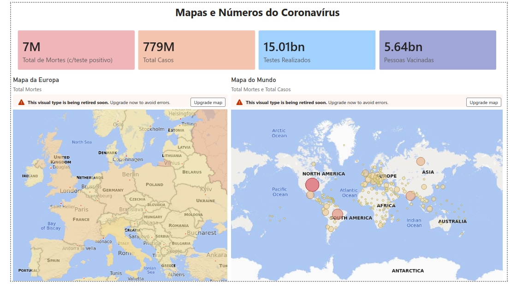
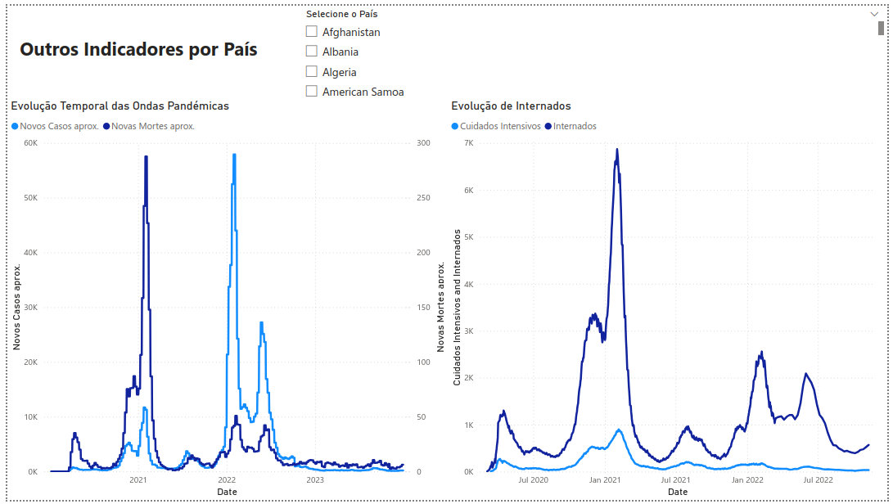

# COVID-19 Data Visualization — Power BI

**Disciplina:** SVDC
**Docentes:** Jorge Gustavo Rocha | Paulo Dias Almeida  
**Mestrado em Inteligência Artificial — Universidade do Minho**

---

## Dataset

**Fonte:** [Our World in Data — COVID-19 Dataset](https://ourworldindata.org/covid-deaths)  
**Ficheiro:** `owid-covid-data.csv`  
**Cobertura:** Janeiro 2020 – 2024 | 200+ países

O dataset agrega dados oficiais de casos, mortes, vacinações, hospitalizações, testes e indicadores socioeconómicos por país e por dia, compilados pela Our World in Data a partir da OMS e outras fontes oficiais.

> Os valores de mortes confirmadas (~7M a nível mundial) representam apenas casos com teste positivo confirmado. Estimativas de mortalidade em excesso apontam para um valor real entre 19 e 36 milhões de mortes — o dataset reflete o mínimo oficial reportado.

---

## Transformações Aplicadas (Power Query)

As transformações foram realizadas no **Power Query Editor** do Power BI antes de carregar os dados no modelo semântico.

### 1. Filtered Rows — Remoção de Agregados

```
Filtered rows where [continent] is not null
```

O dataset OWID inclui linhas de agregados regionais e económicos como `"World"`, `"Europe"`, `"High income"`, `"Asia"`, entre outros. Estas linhas não representam países reais e distorceriam as visualizações comparativas. O filtro `continent ≠ null` remove-as, mantendo apenas registos de países individuais.

### 2. Changed Column Types — Conversão de Tipos

As seguintes colunas foram convertidas explicitamente para tipo **Number**, dado que o Power Query as inferiu incorretamente como texto durante a importação do CSV:

| Coluna | Tipo Aplicado |
|---|---|
| `hosp_patients` | Number |
| `icu_patients` | Number |
| `total_tests` | Number |
| `positive_rate` | Number |
| `people_vaccinated` | Number |
| `people_fully_vaccinated` | Number |

### 3. DateTable — Tabela de Datas

Foi criada uma tabela de datas dedicada (`DateTable`) a partir da coluna `date`, marcada como **Date Table** no modelo. Esta tabela permite utilizar funções de inteligência temporal em DAX e garante uma hierarquia de datas correta nas visualizações (Ano → Trimestre → Mês → Dia).

---

## Medidas DAX

Para evitar a soma incorreta de colunas cumulativas (somar todos os dias acumulados de todos os países), foram criadas medidas DAX que extraem o **último valor de cada país** e os somam corretamente:

```dax
Total Mortes =
SUMX(
    VALUES('compact'[country]),
    CALCULATE(MAX('compact'[total_deaths]))
)

Total Casos =
SUMX(
    VALUES('compact'[country]),
    CALCULATE(MAX('compact'[total_cases]))
)

Pessoas Vacinadas =
SUMX(
    VALUES('compact'[country]),
    CALCULATE(MAX('compact'[people_vaccinated]))
)

Testes Realizados =
SUMX(
    VALUES('compact'[country]),
    CALCULATE(MAX('compact'[total_tests]))
)

Excess Deaths per 100k =
DIVIDE(SUM('compact'[excess_mortality_cumulative_per_million]), 10)
```

---

## Objetivos das Visualizações

### Insight 1 — Mapas e Números Globais

**Pergunta:** Qual foi o impacto global da pandemia em números absolutos?

KPI cards com totais mundiais (mortes, casos, vacinados, testes) combinados com um mapa coroplético de mortalidade por país e um mapa de pontos com internamentos em UCI — permite uma leitura imediata da escala da pandemia e da sua distribuição geográfica.

### Insight 2 — Evolução Temporal das Ondas Pandémicas

**Pergunta:** Como evoluíram os casos e mortes ao longo do tempo? As grandes ondas são visíveis?

Line chart com `new_cases_smoothed` e `new_deaths_smoothed` (médias móveis suavizadas) para identificar claramente as grandes ondas pandémicas — Alpha, Delta e Omicron. A suavização elimina o ruído dos fins de semana em que os países não reportavam dados.

### Insight 3 — Pressão Hospitalar por País

**Pergunta:** Que pressão exerceu a pandemia nos sistemas de saúde?

Evolução temporal dos internamentos em enfermaria e cuidados intensivos (`hosp_patients` e `icu_patients`) com slicer por país, mostrando como a pressão hospitalar acompanhou — com desfasamento — as ondas de casos.

---

## Ferramentas

- **Power BI Desktop** — modelação e visualização
- **Power Query** — limpeza e transformação dos dados
- **DAX** — medidas calculadas

---

## Como Reproduzir

1. Descarregar o dataset em [ourworldindata.org/covid-deaths](https://ourworldindata.org/covid-deaths)
2. Abrir o ficheiro `.pbix` incluído neste repositório no Power BI Desktop
3. Em **Transform Data**, verificar que o caminho do ficheiro CSV está correto e atualizar se necessário
4. Clicar em **Close & Apply**

---

## Resultados

### Página 1 — Mapas e Números do Coronavírus

KPI cards com totais globais (mortes, casos, vacinados, testes) e dois mapas: coroplético de mortalidade por país e mapa de pontos com internamentos em UCI. Inclui slicer de país para filtrar todas as visualizações da página.



---

### Página 2 — Outros Indicadores por País

Evolução temporal das ondas pandémicas com casos e mortes suavizados, e evolução dos internamentos hospitalares (enfermaria vs. cuidados intensivos). Slicer de país permite análise individual por nação.



---

